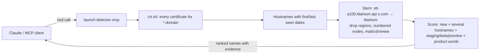

# launch-detector-mcp

<!-- mcp-name: io.github.alialtunar/launch-detector-mcp -->

**See what a company is building before they announce it.** Every website needs a TLS certificate, and every certificate is published in public [certificate transparency](https://certificate.transparency.dev/) logs, usually weeks before a new subdomain goes live. This MCP server reads those logs through [crt.sh](https://crt.sh/) and surfaces new product-like subdomains, so Claude (or any MCP client) can tell you what a competitor might be about to launch.

No API keys. One line to install.

```
You:    Anything new brewing at Linear?
Claude: [launch_signals(domain="linear.app", days=365)]
        • "orbit" is the strongest new name: orbit.linear.app and *.orbit.linear.app
          first got certificates on 2026-08-24. A wildcard under it suggests
          something that hosts many sub-sites.
        • "checkout" (2026-06-29) and "asks" (2026-02-10) are also new.
        These are hints from certificate logs, not announcements.
```
<sub>Summarized from real tool output, 1 Oct 2026.</sub>


## Why

| You want to know | Without it | With launch-detector |
|---|---|---|
| What a competitor is building | Wait for the press release | `launch_signals` ranks new product-like names |
| Whether a rumored product is real | Guess | `new_subdomains` shows the raw hostnames and dates |
| When a company got busy | Nothing | `subdomain_timeline` shows new hostnames per month |
| What changed across 5 rivals this month | Check each by hand | `watch_domains` gives one radar table |

## How it works



Staging, beta, preview and sandbox variants are kept as signals, not dropped: a product that gets a staging host first is often close to launch. Results are cached for a day on disk (`~/.cache/launch-detector`).

## Install

Requires [uv](https://docs.astral.sh/uv/).

**Claude Code**
```bash
claude mcp add launch-detector -- uvx launch-detector-mcp
```

**Claude Desktop / Cursor** (`claude_desktop_config.json` / `.cursor/mcp.json`)
```json
{
  "mcpServers": {
    "launch-detector": {
      "command": "uvx",
      "args": ["launch-detector-mcp"]
    }
  }
}
```

## Tools

| Tool | What it does |
|---|---|
| `launch_signals` | New product-like names under a domain in the window, ranked, with the reasons and example hostnames |
| `new_subdomains` | Raw evidence: every hostname first seen in the window, with its name and environment words |
| `subdomain_timeline` | New hostnames per month and which product-like names appeared each month |
| `watch_domains` | Radar over 2–8 competitors: new hostnames and top signals per company |
| `hostname_history` | First/last certificate, count and issuers for one hostname |

**Prompts:** `whats_coming` (one company), `competitor_radar` (several companies).

## Try these

- "What might Stripe launch next? Use the last 6 months."
- "Run a launch radar on openai.com, anthropic.com and mistral.ai for the last 30 days."
- "When did Linear's certificate activity spike this year?"

## Limits (read these)

- **Hints, not proof.** A new hostname can be an internal tool, a test, a vendor integration or a renamed service.
- Companies that use wildcard certificates (`*.example.com`) for everything reveal less.
- crt.sh is a free community service: it is slow (20–60 s for big domains) and often busy; the server retries and caches, but sometimes you will need to try again.
- Only public certificate data is used. Please use it for market research, not to probe systems.

## Part of the keyless MCP series

Open-source MCP servers that answer one market question each, with public data and no API keys.

| Server | Question it answers |
|---|---|
| [review-miner-mcp](https://github.com/alialtunar/review-miner-mcp) | What do users hate about competitor apps and games? (App Store + Steam reviews) |
| [pricing-time-machine-mcp](https://github.com/alialtunar/pricing-time-machine-mcp) | How did a SaaS pricing page change over the years? (Wayback Machine) |
| [hn-hiring-trends-mcp](https://github.com/alialtunar/hn-hiring-trends-mcp) | Which skills are tech companies hiring for, and which are rising? (HN Who is hiring) |
| [model-price-radar-mcp](https://github.com/alialtunar/model-price-radar-mcp) | What does each LLM cost, and did it get cheaper? (OpenRouter + price history) |
| **launch-detector-mcp** (this one) | What is a company about to launch? (certificate transparency logs) |

## Development

```bash
uv sync --extra dev
uv run pytest                          # offline tests with a mocked crt.sh
uv run python scripts/smoke_live.py    # live check against crt.sh (a few minutes)
uv run --with rich python scripts/demo.py linear.app   # terminal demo (vhs docs/demo.tape records the GIF)
```

MIT © Ali Altunar
